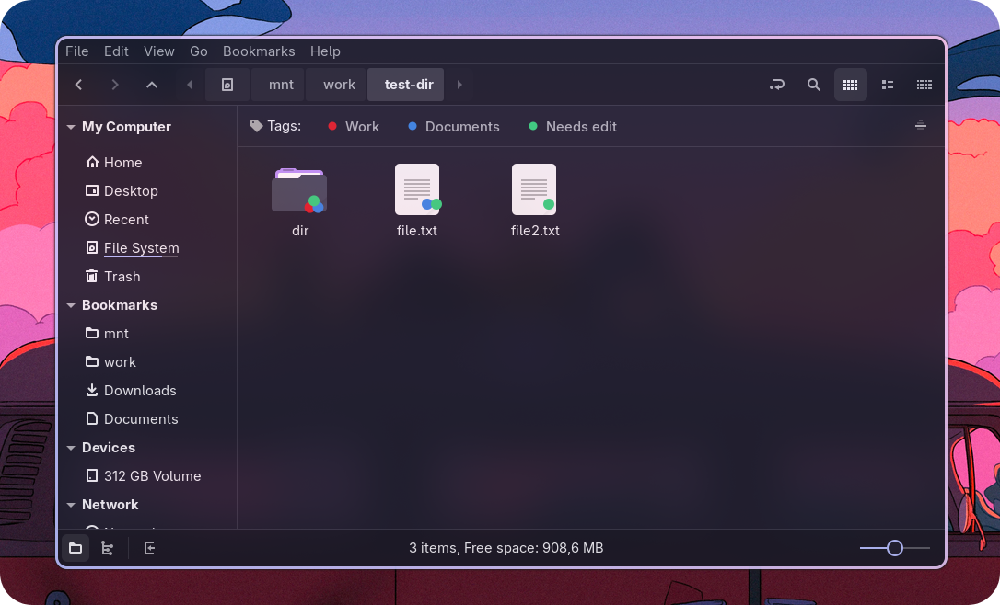
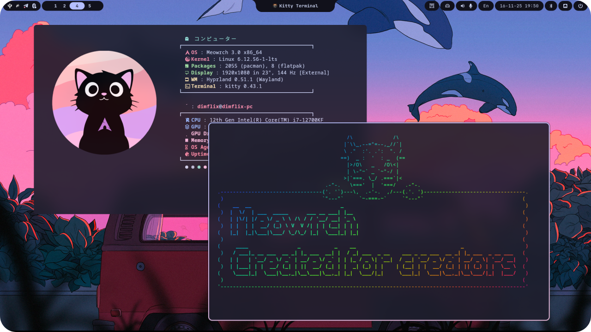

<div align="center">


# 🏷️ Nemo Tags

**A powerful tagging system for Nemo File Manager**

[](https://github.com/meowrch/nemo-tags/issues)
[](https://github.com/meowrch/nemo-tags/stargazers)
[](./LICENSE)


[](./README.ru.md)
[](./README.md)

[Features](#-features) • [Installation](#-installation) • [Usage](#-usage) • [Configuration](#-configuration)

</div>

---

<br>




## ✨ Features

### 🎨 **Color-Coded Tags**
Create unlimited tags with custom names and colors. Organize your files visually with a palette that matches your workflow.

### 🖱️ **Context Menu Integration**
Right-click any file or folder to quickly assign or remove tags. Multi-select support makes batch tagging effortless.

### 🔍 **Virtual Tag Folders**
Click on any tag to open a dedicated view showing all tagged files in one place. Files appear as symbolic links, keeping your original directory structure intact.

### 🎯 **Visual Emblems**
Tagged files display color-coded emblems directly on their icons. Multiple tags? No problem — emblems combine elegantly to show up to three tag colors at once.

### 🚀 **Tag Bar Widget**
A sleek horizontal bar beneath Nemo's address bar displays all your tags. Left-click to browse, right-click to manage.

### 📦 **Lightweight & Private**
All tag data is stored in a simple JSON file in your home directory. No database servers, no cloud sync, no extended attributes on your filesystem.

---

## 🎯 Use Cases

<table>
<tr>
<td width="33%" align="center">
<h3>📸 Photography</h3>
Tag photos by project, client, or editing status. Find all "favorites" or "needs-edit" files instantly.
</td>
<td width="33%" align="center">
<h3>📚 Research</h3>
Organize papers by topic, priority, or reading status across multiple directories.
</td>
<td width="33%" align="center">
<h3>💼 Projects</h3>
Mark files as "urgent", "in-progress", or "archived" without moving them from project folders.
</td>
</tr>
</table>

---

## 📦 Installation

### Method 1: AUR (Arch Linux)

```bash
yay -S nemo-tags
# or
paru -S nemo-tags
```

### Method 2: Manual Installation

#### Prerequisites

Ensure you have the following packages installed:

```bash
# Debian/Ubuntu
sudo apt install nemo-python python3-gi python3-cairo

# Arch Linux
sudo pacman -S nemo-python python-gobject python-cairo

# Fedora
sudo dnf install nemo-python python3-gobject python3-cairo
```

#### Installation Steps

1. **Clone the repository:**

```bash
git clone https://github.com/meowrch/nemo-tags.git
cd nemo-tags
```

2. **Install the extension:**

```bash
mkdir -p ~/.local/share/nemo-python/extensions
ln -s "$(pwd)/nemo-extension/nemo-tags.py" ~/.local/share/nemo-python/extensions/nemo-tags.py
```

3. **Restart Nemo:**

```bash
nemo -q
```

The extension will load automatically when you open Nemo again.

---

## 🎮 Usage

### Creating Your First Tag

1. Right-click any file or folder
2. Select **"Assign Tag"** → **"Create Tag"**
3. Enter a name and choose a color
4. Click **OK**

The tag is automatically assigned to the selected files!

### Assigning Tags

Right-click on the file(s) to open the **context menu** → **“Assign Tag”** → Select the tag name

Tags that have already been assigned are displayed with a check mark (✓)

### Browsing Tagged Files

**Click any tag button** in the tag bar to open a virtual folder containing all files with that tag. These folders use symbolic links, so:
- Original files remain in their locations
- Changes to files are reflected everywhere
- No disk space is duplicated

### Managing Tags

**Edit or Delete:**
- Right-click a tag button in the tag bar
- Select **"Rename tag"** to change the name
- Select **"Change color"** to change the color
- Select **"Delete Tag"** to remove it entirely

**Reorder:**
- Click on the button at the top right to open the window for changing the order of tags.

---

## ⚙️ Configuration

### Data Storage

All tag data is stored in:

```
~/.local/share/nemo-tags/
├── tags.json          # Tag database
├── emblems/           # Generated emblem icons
└── views/             # Virtual tag folders
    └── tag-<id>/      # Symbolic links to tagged files
```

### Database Format

The `tags.json` file uses a simple structure:

```json
{
  "tags": [
    {
      "id": "a3f9c2e7",
      "name": "Important",
      "color": "#FF5252"
    }
  ],
  "index": {
    "a3f9c2e7": [
      "/home/user/Documents/report.pdf",
      "/home/user/Photos/vacation.jpg"
    ]
  }
}
```

### Backup

To backup your tags, simply copy the directory:

```bash
cp -r ~/.local/share/nemo-tags ~/nemo-tags-backup
```

---

## 🛠️ Technical Details

### Architecture

- **Extension Type:** Nemo Python extension
- **UI Framework:** GTK 3 via PyGObject
- **Database:** JSON-based flat file
- **Virtual Folders:** Symbolic links

### Components

| Module | Purpose |
|--------|----------|
| `database.py` | Tag storage and indexing |
| `manager.py` | Business logic and file operations |
| `extension.py` | Nemo integration (menus, emblems, info) |
| `ui.py` | Tag bar widget and dialogs |
| `icons.py` | Dynamic icon and emblem generation |

### Performance

- **Startup Time:** < 200ms for 1000+ tags
- **Emblem Rendering:** Async generation with icon cache
- **Virtual Folders:** Generated on-demand, cached

---

## 🎨 Built With

<div align="center">

**Developed on**

<a href="https://github.com/meowrch">

</a>

*[Meowrch](https://github.com/meowrch/meowrch) — A Linux distribution built for creators and developers*

</div>

---

## 🤝 Contributing

Contributions are welcome! Here's how you can help:

- 🐛 Report bugs and request features via [Issues](https://github.com/meowrch/nemo-tags/issues)
- 🔧 Submit pull requests with improvements
- 📖 Improve documentation
- 🌍 Add translations

---

## 📝 License

This project is licensed under the **GPL-3.0 License** - see the [LICENSE](LICENSE) file for details.

---

## 🙏 Acknowledgments

- [**Nemo File Manager**](https://github.com/linuxmint/nemo) — The extensible file manager from Linux Mint
- [**PyGObject**](https://github.com/pygobject) — Python bindings for GTK
- [**Meowrch**](https://github.com/meowrch/meowrch) — For providing an excellent development environment

---

<div align="center">

**Made with ❤️ for the Linux community**

[⭐ Star this repo](https://github.com/meowrch/nemo-tags) • [🐛 Report Bug](https://github.com/meowrch/nemo-tags/issues) • [✨ Request Feature](https://github.com/meowrch/nemo-tags/issues)

</div>
